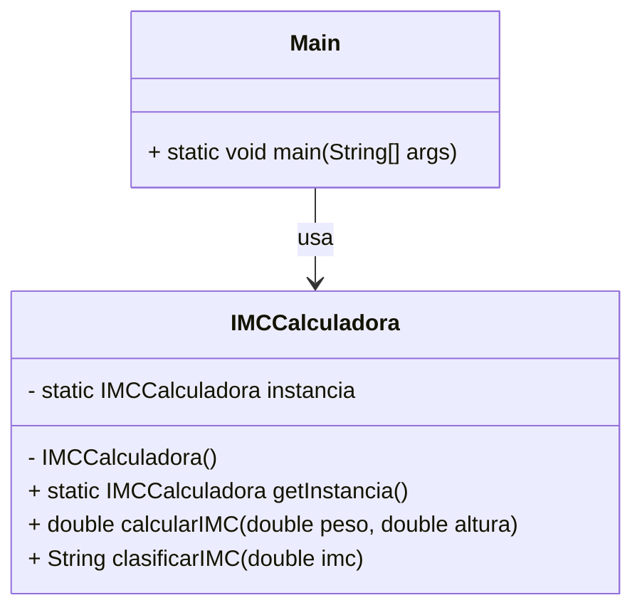

# Proyecto Java - IMC con Patrón Singleton

Este proyecto en Java, desarrollado en NetBeans, implementa el **Patrón de Diseño Singleton** para calcular el **Índice de Masa Corporal (IMC)**.  
El Singleton garantiza que exista **una sola instancia** de la clase encargada de realizar los cálculos de IMC.

---

## 🚀 Funcionalidades
- Solicita al usuario **peso** y **altura**.
- Calcula el **IMC** usando la fórmula:  
  \[
  IMC = \frac{peso}{altura^2}
  \]
- Clasifica el resultado según valores estándar:
  - **Bajo peso**
  - **Normal**
  - **Sobrepeso**
  - **Obesidad**

---

## 🛠️ Tecnologías
- **Java SE**
- **NetBeans IDE**
- Patrón de diseño **Singleton**
- Entrada/salida por **consola**

---

## 📂 Estructura del proyecto
```
ProyectoIMCSingleton/
│── src/
│   ├── imc/
│   │   ├── IMCCalculadora.java   # Clase Singleton
│   │   └── Main.java             # Clase principal con main()
│── README.md
```

---

## 📊 Diagrama UML



---

## ▶️ Ejemplo de ejecución
```
Ingrese su peso (kg): 70
Ingrese su altura (m): 1.75
Su IMC es: 22.86 (Normal)
```

---

## 📌 Autor
Proyecto de demostración para el uso del **Patrón Singleton en Java**.
